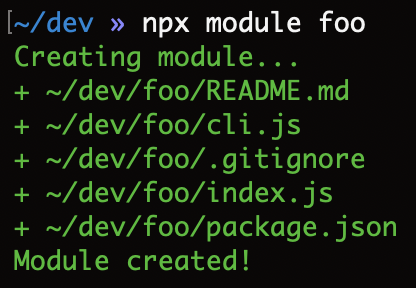

# module [](https://www.npmjs.com/package/module)

Generate the minimal skeleton for a new node.js module/package.



## Usage

For example, to create a module in the current working directory:

```sh
$ npx module
```

To create a module in another directory, specify a relative or absolute path:

```sh
$ npx module foo
```

The `--system` flag can be provided to control whether the module system is ESM (the default if flag not specified) or CommonJS:

```sh
$ npx module foo --system esm
```

```sh
$ npx module foo --system cjs
```

And the `--identifier` flag can be provided to control whether the module system is identified by file extension (the default if flag not specified), package.json `type` field, or implicitly from code syntax:

```sh
$ npx module foo --system esm --identifier file-ext
```

```sh
$ npx module foo --system cjs --identifier package-type
```

```sh
$ npx module foo --system esm --identifier syntax
```

To understand these flags better, see [Determining module system](https://nodejs.org/api/packages.html#determining-module-system) in the node.js docs.
